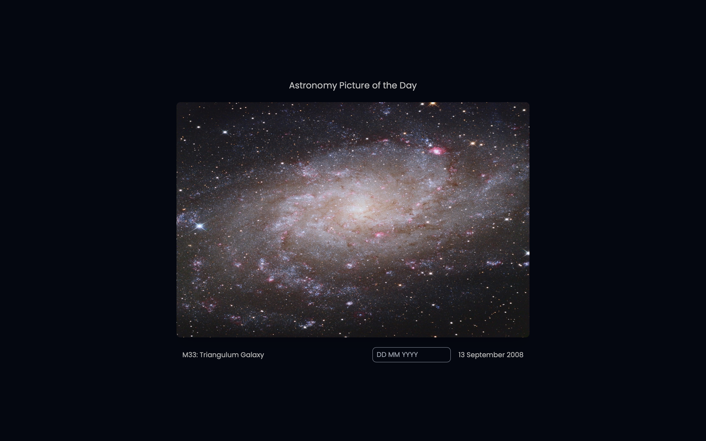
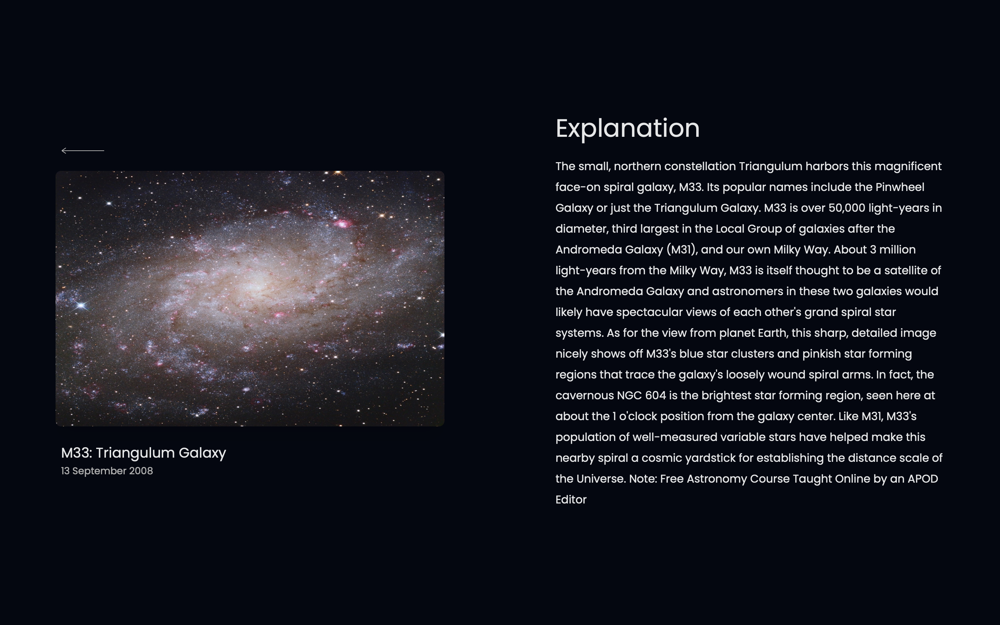

# StellarVisions

StellarVisions (part of the project for my Front End Engineering (FEE) course) is a webapp that allows you to explore the beauty of the cosmos through NASA's Astronomy Picture of the Day (APoD).

# UI Interface
<div align="center">
    
    
</div>

## Getting Started

These instructions will help you set up a local development copy of StellarVisions for testing and development purposes.

### Prerequisites

To run StellarVisions locally, you need to have the following installed:

- Node.js
- npm (Node Package Manager)

### Installation

1. Clone the repository to your local machine:

```bash
git clone https://github.com/BugReportOnWeb/stellar-visions.git
```

2. Navigate to the project directory:
```bash
cd stellar-visions
```

3. Install the project dependencies:
```bash
npm install
```

4. Create a `.env` file and add you [NASA API key](https://api.nasa.gov) in it:
```
VITE_API_KEY=<YOUR-API-KEY>
```

4. Start the development server:
```bash
npm run dev
```

Open your browser and visit http://localhost:5173 to view StellarVisions locally.

